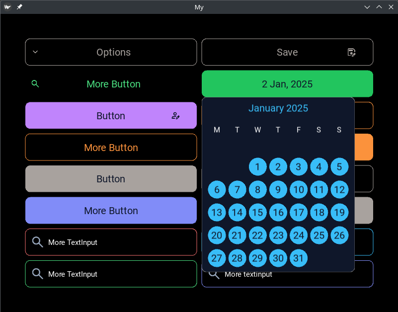
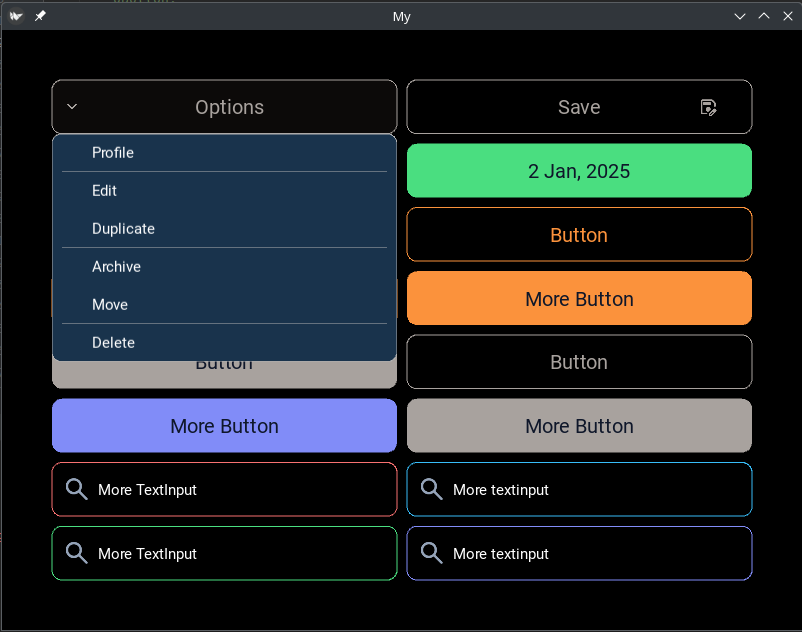

# GakoUI

GakoUI is a collection of widgets for [Kivy](https://kivy.org), inspired by the
JavaScript library [Nuxt UI](https://ui.nuxt.com). The goal is to bring Nuxt
UI's clean, modern look and component-first API to Python desktop apps built
with Kivy.





## Requirements

- Python **>= 3.13** (the bundled Kivy SDL2 provider is currently broken on 3.14)
- [Kivy](https://kivy.org) >= 2.3.1

## Installation

From source (recommended while the package is not on PyPI yet):

```bash
git clone https://github.com/Gako91/gakoUI.git
cd gakoUI
uv sync          # or: pip install -e .
```

## Quickstart

```python
from kivy.app import App
from kivy.uix.boxlayout import BoxLayout
from gakoui.widgets import UButton, UCard, UCardHeader, UCardTitle, UCardContent


class Demo(App):
    def build(self):
        root = BoxLayout(orientation="vertical", padding=20, spacing=20)

        card = UCard(variant="elevated", color="blue")
        header = UCardHeader()
        header.add_widget(UCardTitle(text="Hello GakoUI"))
        card.add_widget(header)
        content = UCardContent()
        content.add_widget(UButton(text="Click me", color="blue"))
        card.add_widget(content)

        root.add_widget(card)
        return root


if __name__ == "__main__":
    Demo().run()
```

A larger demo showcasing every widget is available in [main.py](main.py):

```bash
uv run python main.py
```

## Widgets

| Widget       | Module                                        | Description                                                                       |
| ------------ | --------------------------------------------- | --------------------------------------------------------------------------------- |
| `UButton`    | [ubutton.py](gakoui/widgets/ubutton.py)       | Button with `solid` / `outline` / `ghost` variants, hover state, left/right icons |
| `UTextInput` | [utextinput.py](gakoui/widgets/utextinput.py) | Single-line text input with optional leading icon                                 |
| `UDropDown`  | [udropdown.py](gakoui/widgets/udropdown.py)   | Button that opens a dropdown of items                                             |
| `USelect`    | [uselect.py](gakoui/widgets/uselect.py)       | Select / combobox, single or multiple                                             |
| `UCheckbox`  | [ucheckbox.py](gakoui/widgets/ucheckbox.py)   | Checkbox + optional group                                                         |
| `UToggle`    | [utoggle.py](gakoui/widgets/utoggle.py)       | Animated on/off switch                                                            |
| `USlider`    | [uslider.py](gakoui/widgets/uslider.py)       | Value & range slider                                                              |
| `UCard`      | [ucard.py](gakoui/widgets/ucard.py)           | Card with `Header` / `Title` / `Description` / `Content` / `Footer`               |
| `UModal`     | [umodal.py](gakoui/widgets/umodal.py)         | Modal dialog with `Header` / `Body` / `Footer`                                    |
| `UTabs`      | [utabs.py](gakoui/widgets/utabs.py)           | Tab bar + `UTabPanel`                                                             |
| `UBadge`     | [ubadge.py](gakoui/widgets/ubadge.py)         | Text / dot / number badge                                                         |
| `UAlert`     | [ualert.py](gakoui/widgets/ualert.py)         | `success` / `error` / `warning` / `info` alert banner                             |
| `UDataTable` | [udatatable.py](gakoui/widgets/udatatable.py) | Sortable data table — see [docs/UDataTable.md](docs/UDataTable.md)                |
| `DatePicker` | [datepicker.py](gakoui/widgets/datepicker.py) | Calendar date picker                                                              |

All widgets share the same Tailwind-like colour palette (`green`, `blue`,
`red`, `orange`, `stone`, …) defined in [gakoui/data/colors.py](gakoui/data/colors.py).

## Project layout

```
gakoui/
├── behaviors/        # HoverBehavior
├── data/
│   ├── colors.py     # colour palette
│   └── icons/        # bundled PNG icons
└── widgets/          # all UI widgets
```

## License

[MIT](LICENSE) © Gako

## Credits

GakoUI is inspired by [Nuxt UI](https://ui.nuxt.com) (Vue / Nuxt component
library by NuxtLabs). Widget names, variants and the Tailwind-like colour
palette follow the same conventions to make the API familiar to anyone coming
from the Nuxt UI ecosystem. GakoUI is an independent project and is not
affiliated with or endorsed by NuxtLabs.
